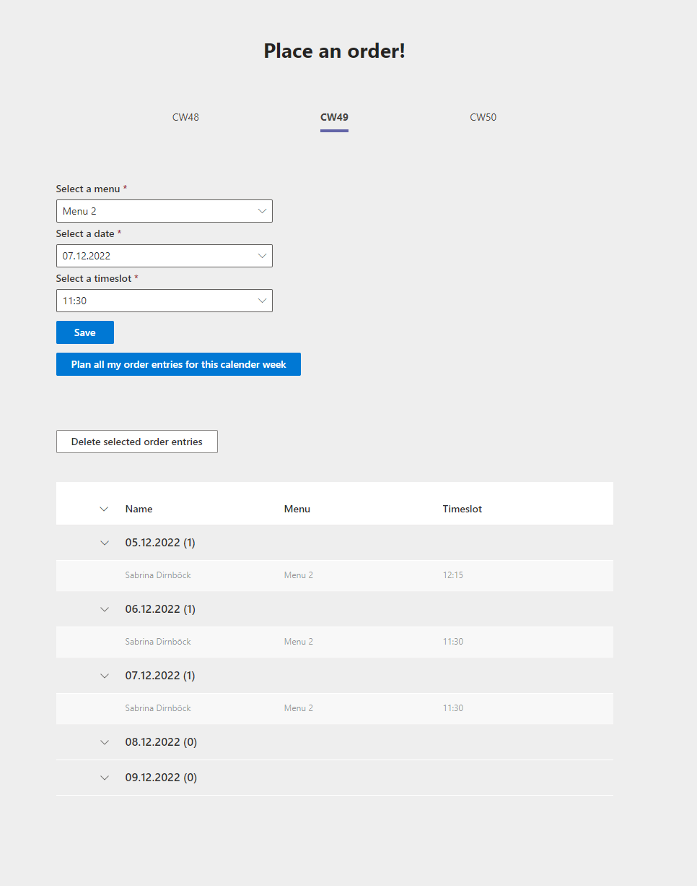

# Getting Started with Ordering App

## Description

Ordering app is a TeamsFx tab that allows users to place orders for a canteen. A user can select a menu and date with timeslot to save to a Sharepoint list. \
All the placed orders for the calender week will be displayed in a grouped list where they can also be deleted by the creator. Not yet planned entries for the calender week can be planned. \
Used Technologies: TeamsFx, React with Typescript, React-Query for API Calls

### Overview
When opening the app for the first time you will be asked to login and give the app permission (delegated) for all the required scopes.  
The application requires following scopes: "User.Read", "Calendars.ReadWrite", "Sites.Read.All", "Sites.ReadWrite.All", "Sites.Manage.All". 

Then the menu displays the current, the future and the calender week after, where menus can be selected with a date and timeslot.
On saving, the grouped list will update and display the new entry. 

In case no Sharepoint list is found, a button will appear to create a new one. The default name for the list is "orders", but can be changed in [tabs/src/Constants.ts](tabs/src/Constants.ts). 
Because the list requires filtering, some columns have an index set. 

All order entries of a user can be planned in a calender week. Once an entry is planned, the Sharepoint list gets patched to record that it's already been planned. 
Already planned entries will be skipped for future planning. 

Multiple entries can be selected for deleting. Only the user who created the entry, will also be able to delete it. 

Graph API was used for accessing the Sharepoint list and posting calender events.  

## Prerequisites
- [NodeJS](https://nodejs.org/en/), fully tested on NodeJS 14, 16
- A Microsoft 365 account.
- [Teams Toolkit Visual Studio Code Extension](https://aka.ms/teams-toolkit) or [TeamsFx CLI](https://aka.ms/teamsfx-cli)
- Sharpoint Site and its Site Collection Id - Either create a new site, or use a pre-existing one.

### How to obtain Sharepoint Site Collection Id
An easy way to obtain a Site Collection Id would be to type the following link into a browser: \
[https://\<tenant>\.sharepoint.com/sites/\<site-url>\/_api/site/id](https://<tenant>.sharepoint.com/sites/<site-url>/_api/site/id)

Example:\
tenant = abcdef\
site = https://abcdef.sharepoint.com/sites/orderingsite/\
Link would be: https://abcdef.sharepoint.com/sites/orderingsite/_api/site/id

Alternatively a Sharepoint Site Collection Id could als be obtained with powershell. 

After obtaining the Site Id, you need to assign it to the constant SITEID in [tabs/src/Constants.ts](tabs/src/Constants.ts). 

## Run app with Visual Studio Code Extension:
>Here are the instructions to run the app in **Visual Studio Code**. The app can also be run with TeamsFx CLI tool.
1. Clone the repo to your local workspace or directly download the source code.
1. Download [Visual Studio Code](https://code.visualstudio.com) and install [Teams Toolkit Visual Studio Code Extension](https://aka.ms/teams-toolkit).
1. Open the project in Visual Studio Code.
1. Make sure all packages are installed.
1. Start debugging the project by hitting the `F5` key in Visual Studio Code.

If Visual Studio Code doesn't recognize it's a TeamsFx project, try opening it in the Teams Toolkit Extension.

## Edit the manifest

You can find the Teams manifest in `templates/appPackage` folder. The templates contains:
* `manifest.template.json`: Manifest file for Teams app running locally and remotely.

[Schema reference](https://docs.microsoft.com/en-us/microsoftteams/platform/resources/schema/manifest-schema) for more information.

- The frontend is a react tab app hosted on [Azure Storage](https://docs.microsoft.com/en-us/azure/storage/).
- The backend server is hosted on [Azure Function](https://docs.microsoft.com/en-us/azure/azure-functions/) for managing posts in the tab app.

### Code structure
- Frontend code in: [tabs/src/](tabs/src/)
- Backend code in: [api/](api/)

For this project, all of the logic is implemented in the frontend.

